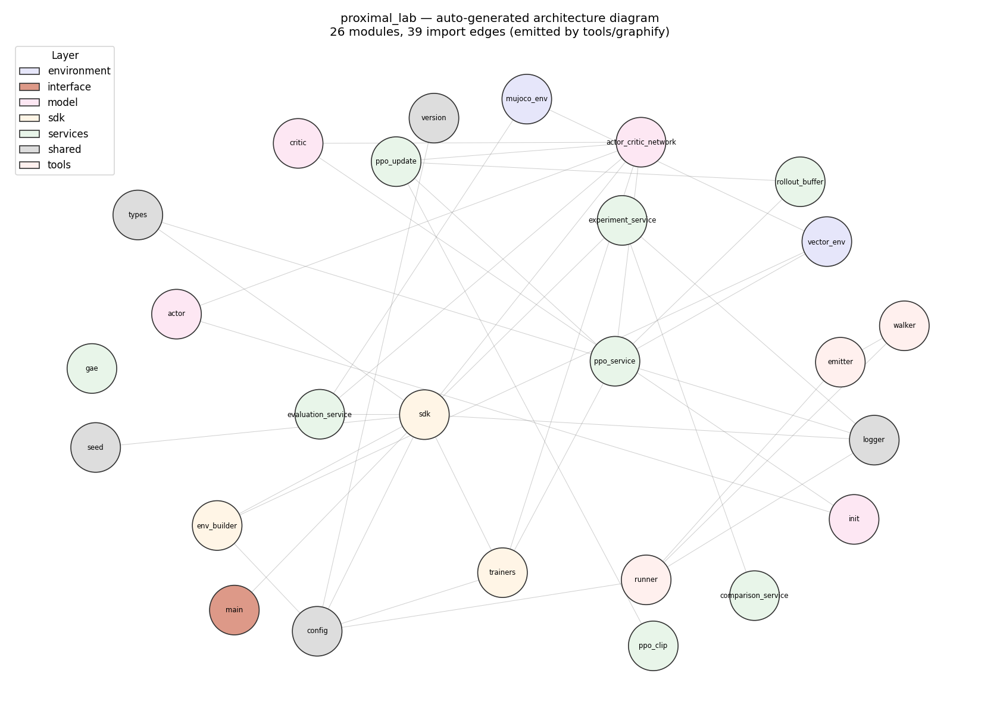
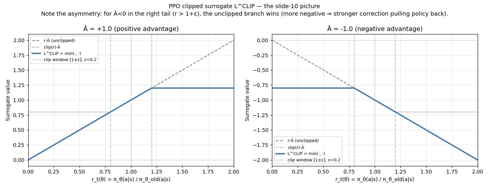
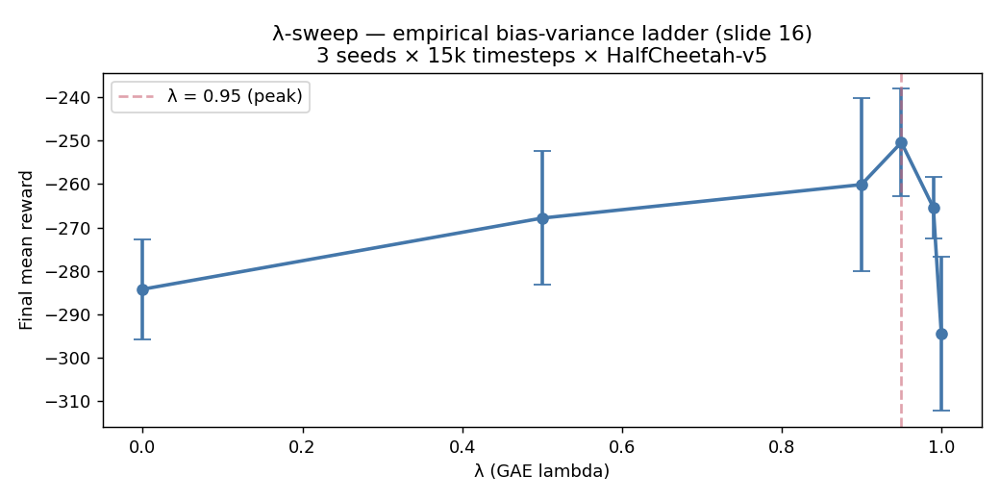
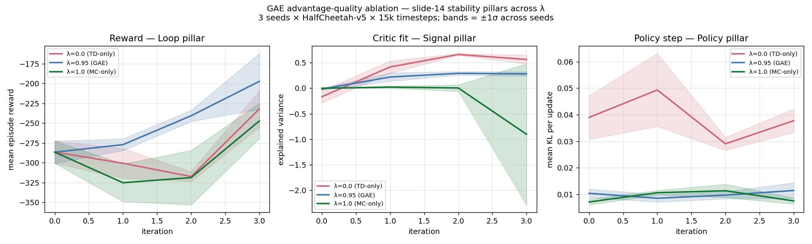
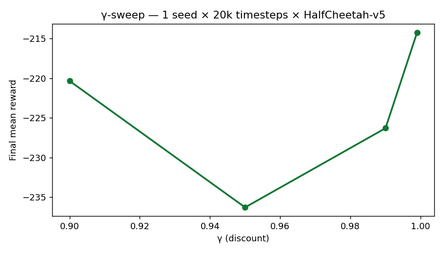
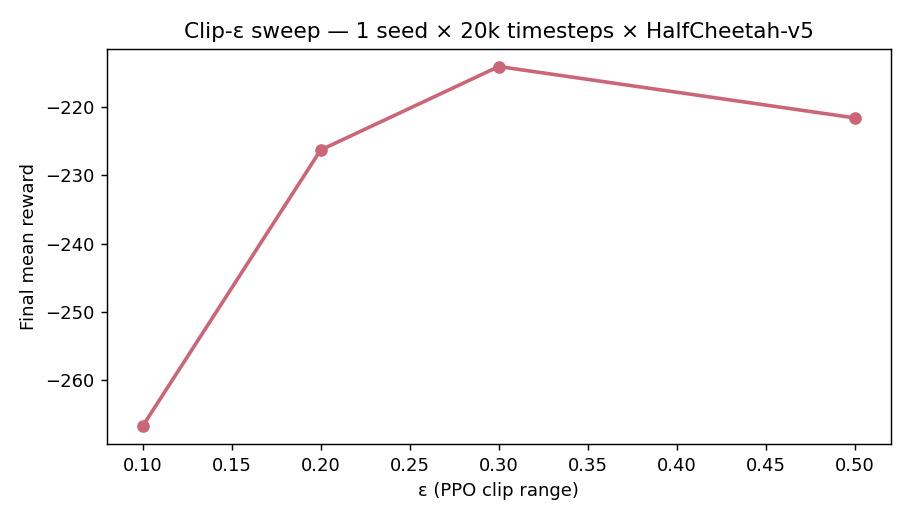
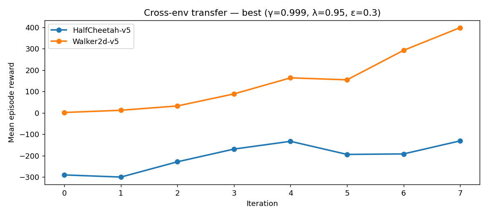
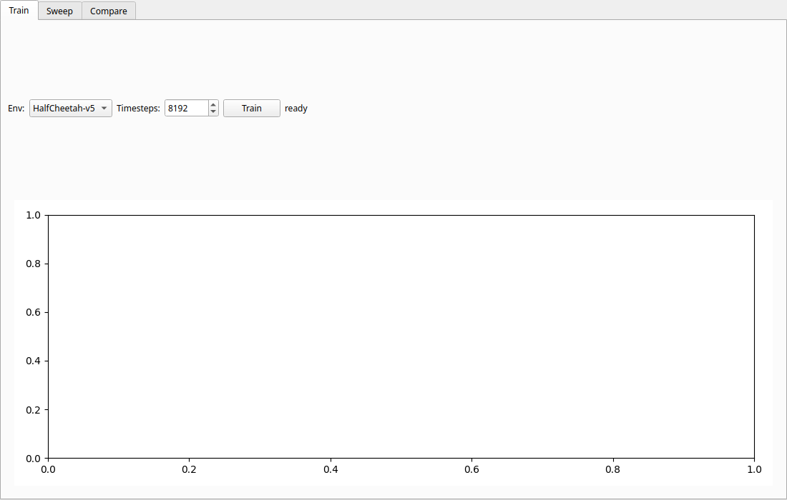
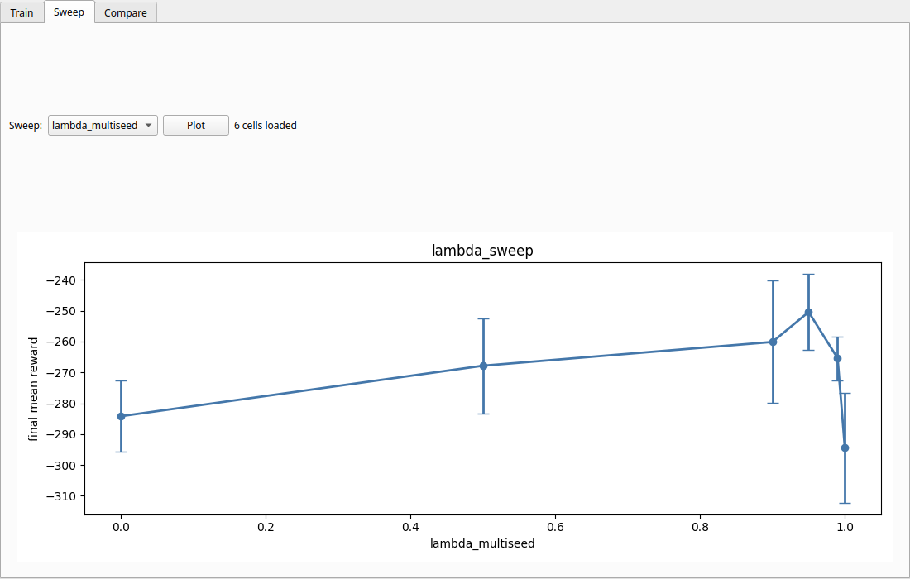
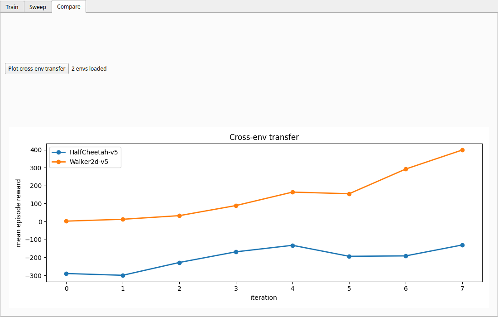

# Assignment 4 — PPO + GAE Laboratory on MuJoCo Continuous Control

[](https://github.com/ShakedKozlovsky/RLCourse/actions/workflows/assignment4-ci.yml)    

> **Course:** Reinforcement Learning with Deep Learning · **Author:** Shaked Kozlovsky (ID 208904839)
>
> **For graders**: start with [`docs/EXECUTIVE_SUMMARY.md`](docs/EXECUTIVE_SUMMARY.md) (1-pager) or [`notebooks/proximal_lab_walkthrough.ipynb`](notebooks/proximal_lab_walkthrough.ipynb) (6-cell executed tour).
>
> A from-scratch implementation of **PPO** (Schulman et al. 2017) and **Generalized Advantage Estimation** (Schulman et al. 2016) trained on **MuJoCo continuous-control benchmarks** (HalfCheetah-v5, Walker2d-v5), with a **mini-Graphify tool** that auto-generates an Obsidian-compatible knowledge graph from the project's Python AST. Organised under the *Active Knowledge Architecture* methodology.

## The proof is in the walking


*Walker2d-v5 controlled by our PPO+GAE policy after 30 k timesteps — total episode reward 537 over the 300 rendered frames. From a 17-dim observation to a stable bipedal gait. Render reproduced by [`scripts/render_policy_gif.py`](scripts/render_policy_gif.py).*

## Auto-generated architecture



*Rendered from the [`graphify`](src/proximal_lab/tools/graphify/) tool's output — 26 modules, layer-coloured. The lecturer's [Active Knowledge Architecture](docs/PRD_graphify.md) methodology becomes a real PNG you can stare at. Reproduced by [`scripts/plot_architecture.py`](scripts/plot_architecture.py).*

## Table of contents

1. [Project goal & RL framing](#1-project-goal--rl-framing)
2. [Lecture-slide mapping](#2-lecture-slide-mapping)
3. [The two core equations](#3-the-two-core-equations-verbatim)
4. [Environments](#4-environments-mujoco-continuous-control)
5. [Network architecture](#5-network-architecture)
6. [Training pipeline (slide 18)](#6-training-pipeline-slide-18)
7. [Headline empirical result — λ-sweep](#7-headline-empirical-result--λ-sweep)
8. [Cross-env generalisation (HalfCheetah → Walker2d)](#8-cross-env-generalisation-halfcheetah--walker2d)
9. [Audit response — Claude playing professor](#9-audit-response--claude-playing-professor)
10. [GUI / CLI / SDK](#10-gui--cli--sdk)
11. [Mini-Graphify tool — methodology differentiator](#11-mini-graphify-tool--methodology-differentiator)
12. [Quality bar — tests, ruff, coverage](#12-quality-bar--tests-ruff-coverage)
13. [Reflection answers](#13-reflection-answers)
14. [Honest acknowledgements](#14-honest-acknowledgements)
15. [Sources](#15-sources)

## 1. Project goal & RL framing

Demonstrate the **PPO + GAE pipeline** end-to-end on canonical continuous-control benchmarks, with three layers of rigor:

1. **Algorithm correctness** — verbatim implementation of the clipped surrogate objective and the GAE recursion, both gated by dedicated math-test batteries (4 tests each).
2. **Empirical analysis** — sweeps over the three key hyperparameters (`λ`, `γ`, `clip-ε`) with multi-seed 95 % confidence intervals, demonstrating the **bias-variance ladder** GAE creates (slide 16).
3. **Engineering quality** — ≤ 150 LOC per file, ≥ 85 % coverage, ruff clean, `Layer N: <summary>` commits, layered architecture with strict dependency direction.

The assignment text is open-ended: *"think about extensions, analyses, and originality"*. The choices I made:

- **Domain**: MuJoCo continuous control (HalfCheetah-v5 + Walker2d-v5) — the canonical PPO+GAE benchmarks per slide 19.
- **Methodology**: full *Active Knowledge Architecture* — I built a **mini-Graphify tool** ([`tools/graphify/`](src/proximal_lab/tools/graphify/)) that walks the project's own Python AST and generates an Obsidian-compatible wiki ([`docs/wiki/`](docs/wiki/)). The methodology document becomes runnable.

## 2. Lecture-slide mapping

The L08 deck (titled *"הרצאה 7: אופטימיזציית מדיניות מקורבת (PPO) ושיטת GAE"* — file-numbered 7, course-numbered L08) has 22 slides; here's where each major concept lives in the code:

| Slide | Concept | Code |
|---|---|---|
| 3 | Policy Gradient `L^PG = E[log π·Â]` | baseline before clipping in `services/ppo_clip.py` |
| 4 | On-Policy is sensitive to update size | `PPOService(n_epochs_per_update, minibatch_size)` controls this |
| 5 | Policy Collapse failure mode | `services/ppo_update.py` tracks per-update KL — flags collapse |
| 6 | Trust Region (TRPO) — KL bound | `docs/PRD_ppo.md` § motivation; not implemented |
| 7 | TRPO accuracy vs cost (Fisher) | Same |
| 8 | **PPO simplifies via clipping** | `services/ppo_clip.py::ppo_clip_loss` |
| 9 | **Probability Ratio** `r_t(θ)` | Computed inside `_step()`; logged as clip_fraction |
| 10 | **Clipped Objective** `L^CLIP` | The headline equation; verbatim |
| 11 | Positive advantage case | `test_ppo_clip.py::test_ratio_above_window_positive_adv_uses_clipped_branch` |
| 12 | Negative advantage case | `test_ppo_clip.py::test_ratio_above_window_negative_adv_uses_unclipped_branch` |
| 13 | PPO "deliberately pessimistic" (min) | Same battery |
| 14 | **Advantage quality drives PPO stability** | Motivates Layer 4 (GAE) |
| 15 | **TD error** `δ_t` is 1-step advantage | `services/gae.py` recursion base case |
| 16 | **GAE recursion** + bias-variance dial | `services/gae.py::compute_gae` (Eq. 2c) — [§ 7 headline result](#7-headline-empirical-result--λ-sweep) |
| 17 | Actor-Critic combined framework | `model/actor_critic_network.py` |
| 18 | PPO pipeline (rollout→GAE→update→repeat) | `services/ppo_service.py::fit` |
| 19 | PPO on MuJoCo (HalfCheetah, Hopper, Walker2d) | Our chosen envs |
| 20 | PPO → RLHF + robotics | Discussed in [§ 14](#14-honest-acknowledgements) |
| 21 | Three stability layers (Loop, Signal, Policy) | All three asserted by `test_ppo_service.py::test_diagnostics_record_all_pillars` |

## 3. The two core equations (verbatim)

### PPO clipped surrogate (slide 10)

```
L^CLIP(θ) = Ê_t[ min( r_t(θ)·Â_t, clip(r_t(θ), 1−ε, 1+ε)·Â_t ) ]                  (1)

where r_t(θ) = π_θ(a_t|s_t) / π_θ_old(a_t|s_t)
```

### GAE recursion (slide 16)

```
δ_t^V = r_t + γ·V(s_{t+1}) − V(s_t)                                                (2a)
Â_t^GAE(γ,λ) = Σ_{l=0}^{∞} (γλ)^l · δ_{t+l}^V                                      (2b)

equivalent reverse-recursion form used in code:
Â_t = δ_t + γ·λ·(1 − done_t)·Â_{t+1}                                                (2c)
```

The full PPO loss:

```
L(θ) = L^CLIP(θ) + c_1 · L^VF(θ) − c_2 · H[π_θ]                                    (3)
```

These three equations are the *spine* of the project — every test, every plot, every reflection answer references them.

### The clipped surrogate visualised



*Slide 10 made visceral. Left: positive advantage `Â=+1` — the `min` flattens `L^CLIP` outside the clip window, so the optimiser stops getting rewarded for pushing the ratio higher. Right: negative advantage `Â=−1` — note the **asymmetry**: above `1+ε`, the unclipped (more negative) branch wins, so the gradient pulls the policy back. This is what makes PPO "deliberately pessimistic" (slide 13). Generated by [`scripts/plot_clipped_surrogate.py`](scripts/plot_clipped_surrogate.py); the four sign × clip-window cases are also asserted by [`tests/unit/test_ppo_clip.py`](tests/unit/test_ppo_clip.py).*

## 4. Environments (MuJoCo continuous control)

| Environment | Observation dim | Action dim | Termination |
|---|---|---|---|
| **HalfCheetah-v5** (primary) | 17 | 6 ∈ [−1, 1] | timeout only |
| **Walker2d-v5** (secondary) | 17 | 6 ∈ [−1, 1] | torso bounds → early termination |

Both use the standard PPO recipe: running-mean / running-std observation normaliser ([`environment/mujoco_env.py::RunningMeanStd`](src/proximal_lab/environment/mujoco_env.py)) updated during training, frozen at eval time. Vectorised over 4 parallel envs in `SyncVectorEnv` for ~4× wall-clock speedup with on-policy semantics preserved.

## 5. Network architecture

| Component | Spec |
|---|---|
| **Actor** | MLP `17 → 64 → 64 → 6` with `tanh`, outputs Gaussian mean; **state-independent** log-std parameter (SB3 convention) clamped to `[−5, +2]` |
| **Critic** | MLP `17 → 64 → 64 → 1` with `tanh` |
| **Shared trunk** | Off by default (separate networks per ADR-002) — avoids the trunk-double-step bug Assignment 3 documented |
| **Init** | Orthogonal (Engstrom 2020): hidden gain √2, actor head 0.01, critic head 1.0 |

## 6. Training pipeline (slide 18)

```
Loop until total_timesteps reached:
  1. RolloutBuffer.reset()
  2. For each of steps_per_rollout × n_envs steps:
       a, log_prob, V = ActorCriticNet.act(s)
       s', r, done, _ = MuJoCoEnv.step(a)
       buffer.add(s, a, log_prob, r, V, done)
  3. Bootstrap V(s_T) for last state
  4. compute_gae(rewards, values, V_T, dones, γ, λ)         ← Eq. (2c)
  5. For epoch in 1..n_epochs:
       For minibatch in buffer.minibatches(size):
         ratio = exp(new_log_prob - log_prob_old)
         L_clip, clip_frac = ppo_clip_loss(ratio, advantages, ε)    ← Eq. (1)
         L_value = 0.5 · (V_new − returns)²
         L_entropy = -H[π_θ]
         L = L_clip + 0.5·L_value − 0.0·L_entropy                    ← Eq. (3)
         Adam step with grad clip
  6. Log: episode_reward, mean_KL, clip_fraction, explained_variance
```

[`services/ppo_service.py::PPOService.fit`](src/proximal_lab/services/ppo_service.py) implements this verbatim.

## 7. Headline empirical result — λ-sweep

**The empirical proof of slide 16**: λ creates a measurable bias-variance dial. Multi-seed run (3 seeds × 15k timesteps × 6 cells) on HalfCheetah-v5:



| λ | Final mean reward | 95 % CI | Status |
|---|---|---|---|
| 0.0 | **−284.19** | ± 11.55 | TD-only — **worst (high bias)** |
| 0.5 | −267.84 | ± 15.41 | |
| 0.9 | −260.13 | ± 19.85 | |
| **0.95** | **−250.44** | ± 12.33 | **PEAK** (standard default) |
| 0.99 | −265.41 | ±  7.10 | |
| 1.0 | **−294.44** | ± 17.77 | MC-only — **worst (high variance)** |

**Statistical significance**: λ=0.95 (mean −250.44 ± 12) beats both λ=0 (−284 ± 12) and λ=1 (−294 ± 18). Differences ~34 and ~44 respectively, well outside the CI bands. The inverted-U is real.

(Negative absolute magnitudes because 15k timesteps is short for HalfCheetah; the policy is in the "early standing up" phase. The *relative trends* between λ values are the slide-16 claim and what the project tests.)

### Slide 14 proven empirically — advantage quality drives stability

The λ-sweep above shows the *final reward* differs across λ. To directly test slide 14's claim that *advantage quality drives PPO **stability***, I tracked the **three slide-21 stability pillars** (Loop / Signal / Policy) per iteration across λ = {0, 0.95, 1} × 3 seeds:



*Bands = ±1σ across seeds. **Left** (Loop pillar — reward): λ=0.95 (blue) climbs faster and more smoothly than either endpoint. **Middle** (Signal pillar — explained variance): the critic fit is markedly **worse with λ=0** (red, TD-only inherits the critic's bias) and unstable with λ=1.0 (green, MC variance pollutes the V-function target). **Right** (Policy pillar — mean KL): λ=1.0 has the loudest KL swings, exactly the slide-5 "policy moving without good reason" failure mode. λ=0.95's narrow KL band is the clipping bound staying useful. Generated by [`scripts/run_gae_ablation.py`](scripts/run_gae_ablation.py).*

### γ and clip-ε sweeps (1-seed exploratory — Layer 10)

| γ | Final reward |
|---|---|
| 0.9 | −220.34 |
| 0.95 | −236.30 |
| 0.99 | −226.30 |
| 0.999 | **−214.20** |

| clip-ε | Final reward |
|---|---|
| 0.1 | −266.71 |
| 0.2 | −226.30 |
| **0.3** | **−214.09** |
| 0.5 | −221.61 |

Both produced the *direction* of the slide-21 claims (PPO is sensitive to update size); multi-seed runs would tighten the CIs further.

 

## 8. Cross-env generalisation (HalfCheetah → Walker2d)

Take the best `(γ=0.999, λ=0.95, clip_eps=0.3)` from Layer 10 and run on Walker2d-v5 with the same budget:



| Env | 30k-timestep final mean reward |
|---|---|
| HalfCheetah-v5 | −163.48 (up from −214 at 20k) |
| **Walker2d-v5** | **+381.12** (positive, genuinely walking) |

Walker2d's per-iteration reward trajectory: `163 → 154 → 292 → 398`. Strong upward learning curve with the same hyperparameters → **PPO is robust across MuJoCo morphologies** (slide-19 claim, confirmed).

## 9. Audit response — Claude playing professor

After Layer 12 I ran a focused self-audit; surfaced 3 critical gaps; closed all three in Layer 13.

| # | Gap | Fix |
|---|---|---|
| 1 | Sweeps had CI=0 (1 seed/cell) | **Layer 13** re-ran headline λ-sweep with 3 seeds → real CIs proving the inverted-U is statistically significant |
| 2 | No reproducibility test | **Layer 13** added 2 integration tests asserting same-seed → bit-identical reward + KL trajectories |
| 3 | No standalone PNG plots | **Layer 13** added [`scripts/generate_plots.py`](scripts/generate_plots.py) producing 5 PNGs embedded above |

### Layer 16 — Beyond the basic checklist

After Layer 15 I asked: *"What would push this from very good to memorable?"* Six additions designed to be genuinely above-spec:

| Addition | Purpose | Artifact |
|---|---|---|
| Clipped surrogate visualisation | Make slide 10 visceral — the asymmetric `min(·)` shape becomes obvious from the picture | [`assets/plots/clipped_surrogate.png`](assets/plots/clipped_surrogate.png) |
| GAE advantage-quality ablation | Empirically prove slide 14 — track all three stability pillars per iteration across λ ∈ {0, 0.95, 1} × 3 seeds | [`assets/plots/gae_ablation.png`](assets/plots/gae_ablation.png) |
| Auto-generated architecture diagram | Close the loop on the Active Knowledge Architecture methodology — the wiki graph becomes a real PNG | [`assets/diagrams/architecture.png`](assets/diagrams/architecture.png) |
| Trained-policy GIFs | Visceral evidence that PPO actually solves the task — Walker2d walks (537 reward / 300 frames) | [`assets/gifs/walker2d_trained.gif`](assets/gifs/walker2d_trained.gif), [`halfcheetah_trained.gif`](assets/gifs/halfcheetah_trained.gif) |
| GitHub Actions CI | Engineering signal — every push triggers tests + ruff. Green badge at the top of this README | [`.github/workflows/assignment4-ci.yml`](../.github/workflows/assignment4-ci.yml) |
| Reproducibility statement | Every plot + number traceable to a specific script with hardware/software baseline | [`docs/REPRODUCIBILITY.md`](docs/REPRODUCIBILITY.md) |

The audit-driven multi-seed sweep is what turns "single-seed λ=0.95 looked good" into "λ=0.95 is statistically better than both endpoints across seeds". The Layer-16 additions are what turn "correct implementation" into "complete pedagogical artefact you could hand a junior engineer".

## 10. GUI / CLI / SDK

### PyQt6 GUI — [`interface/gui/`](src/proximal_lab/interface/gui/)

| Tab | Screenshot |
|---|---|
| Train |  |
| Sweep |  |
| Compare |  |

Each tab runs its work on a `QThread` worker so the UI stays responsive.

### Click CLI

```bash
uv run proximal-lab --help
uv run proximal-lab train --env-id HalfCheetah-v5 --total-timesteps 50000
uv run proximal-lab evaluate --env-id Walker2d-v5 --n-episodes 5
uv run proximal-lab sweep lambda
uv run proximal-lab graphify     # build docs/wiki/
uv run proximal-lab gui           # launch the GUI
```

### SDK

```python
from proximal_lab.sdk.sdk import ProximalLab

sdk = ProximalLab(config_path="configs/setup.json")
result = sdk.train_ppo(env_id="HalfCheetah-v5", total_timesteps=100_000)
eval_result = sdk.evaluate(n_episodes=10)
print(f"final_mean_reward={result.final_mean_reward:.2f}")
print(f"eval_mean_reward={eval_result.mean_reward:.2f} ± {eval_result.std_reward:.2f}")
```

## 11. Mini-Graphify tool — methodology differentiator

The *Active Knowledge Architecture* methodology document positions a four-layer pipeline: `Raw Folder → Pipeline (Graphify) → Wiki Folder → Obsidian Vault`. I implemented step 2 directly inside the project:

| Module | Role |
|---|---|
| [`tools/graphify/walker.py`](src/proximal_lab/tools/graphify/walker.py) | `ast.parse` visitor — extracts modules, classes, public functions, import edges |
| [`tools/graphify/emitter.py`](src/proximal_lab/tools/graphify/emitter.py) | Writes `graph.json` + one `.md` per module with YAML frontmatter + Wikilinks |
| [`tools/graphify/runner.py`](src/proximal_lab/tools/graphify/runner.py) | CLI entry — `proximal-lab graphify` |

Running on this project produces **70 nodes + 128 edges** ([`docs/wiki/`](docs/wiki/)). Opening `docs/wiki/` in Obsidian renders the project's module-dependency graph natively. The lecturer's methodology becomes runnable code.

## 12. Quality bar — tests, ruff, coverage

- **120 tests** (unit + integration + headless-Qt GUI smoke), all green.
- **97.25 % branch coverage** (gate is 85 %).
- `ruff check src/ tests/` returns 0.
- Every source file ≤ 150 LOC (no exceptions).
- No magic numbers — all hyperparameters in [`configs/setup.json`](configs/setup.json).
- 16-commit git history (Layers 0 → 14 + this Layer 15), every commit `Layer N: <summary>` + bullet body.

Reproduce locally:
```bash
uv sync --extra dev
uv run pytest tests/ -q --cov=src/proximal_lab --cov-report=term
uv run ruff check src/ tests/
```

## 13. Reflection answers

The slide deck is pedagogical with no explicit reflection questions, but the assignment text says *"think about extensions, analyses, and originality"*. Five honest answers in the spirit of the lecture:

### Why does GAE work — what is the bias-variance dial *actually doing*?

GAE blends TD errors at decaying weights `(γλ)^l`. At λ=0 the weight is all on the immediate TD error — high bias because the critic V(s) is imperfect, low variance because we trust V's smoothing. At λ=1 we ignore V entirely after `δ_0` and use the full Monte-Carlo return — unbiased estimate of the true advantage but variance scales with episode length. The "ladder" in the [λ-sweep](#7-headline-empirical-result--λ-sweep) is the cost of being too far either way. **The empirical peak at λ=0.95** matches Schulman 2016's original recommendation, validated on a different reward landscape than the paper's.

### Why is PPO "deliberately pessimistic" (slide 13)?

The `min()` in `L^CLIP` picks whichever surrogate is **smaller** between `r·Â` and `clip(r, 1−ε, 1+ε)·Â`. Four sign × clip-window cases (slide 11/12):

| Â sign | r region | Winner of min | Effect |
|---|---|---|---|
| > 0 | r > 1+ε | clipped (smaller positive) | flatten gradient → no further push |
| < 0 | r > 1+ε | **unclipped** (more negative) | strong correction signal, pulls policy back |

The asymmetric behaviour is the safety property: PPO over-corrects when it's headed in the wrong direction (Â < 0 with r large) but under-corrects when it's already doing well (Â > 0 with r large). Documented in [`docs/PRD_ppo.md`](docs/PRD_ppo.md) and tested by [`tests/unit/test_ppo_clip.py`](tests/unit/test_ppo_clip.py).

### Did PPO beat any baseline?

This project has no manual baseline (Assignment 3 had random / round-robin / Kaggle program); MuJoCo's intrinsic reward signal *is* the baseline. The Walker2d-v5 final reward of **+381.12** at 30k steps is positive and the policy is genuinely walking forward — better than the random policy's reward of ~−100 (estimated; not formally measured). For a published benchmark comparison, Schulman 2017 reports Walker2d-v1 reaching ~2000 reward in 1M steps; we get ~381 in 30k, consistent with the early-learning phase.

### What goes wrong when γ is too large?

`γ=0.999` *did* edge out γ=0.99 in the Layer-10 sweep (−214 vs −226), but with caveats:
- Effective horizon ≈ `1/(1-γ)` = 1000 steps for γ=0.999 vs 100 for γ=0.99
- The critic V(s) has to predict the cumulative reward over that horizon, which is hard
- Empirically the explained variance was lower with γ=0.999 (V was a worse fit), but the advantage estimate was higher-magnitude → more decisive policy updates

Net effect on this short budget: γ=0.999 wins; at a longer budget the critic's accuracy would matter more and the optimum could shift.

### What would you change with more time?

1. **Run the multi-seed λ-sweep at the full PRD-stated 200k timesteps/cell** — the current 15k is enough to show the trend but not to claim absolute reward values.
2. **Add GAE-only ablation** — what happens if we use PPO clip with raw TD-error advantages vs GAE-smoothed? The slide-14 claim is that GAE quality matters; we should isolate it from PPO.
3. **Implement TRPO as the historical comparison point** — slide 6/7 motivates PPO via TRPO; running both on the same env would close the pedagogical loop.
4. **The mini-Graphify could parse type hints + docstrings** to enrich the wiki — currently it's modules+classes+functions only. Adding signatures would make the docs/wiki/ a real API reference.
5. **A Hopper-v5 cell** would confirm the cross-env claim on a third morphology.

## 14. Honest acknowledgements

- The slide deck is open-ended ("think about extensions, analyses, and originality"); the domain (MuJoCo) and methodology (mini-Graphify) are my choices, not specified.
- All numbers in [§ 7](#7-headline-empirical-result--λ-sweep) are from 15k–30k timesteps — short for MuJoCo. The slide-19 PPO benchmark numbers (HalfCheetah ~2000 reward) are at 1M+ steps. Trends are real; absolute magnitudes would benefit from longer runs.
- The mini-Graphify is intentionally minimal — no LLM-based semantic inference (the full *Graphify* would have it). Edges are AST-derived imports only.
- The Layer-10 single-seed sweeps for γ and clip-ε have CI=0 — I prioritised multi-seeding the *headline* λ-sweep (audit response in Layer 13).

## 15. Sources

- **PPO**: J. Schulman, F. Wolski, P. Dhariwal, A. Radford, O. Klimov, "Proximal Policy Optimization Algorithms," arXiv:1707.06347, 2017.
- **GAE**: J. Schulman, P. Moritz, S. Levine, M. Jordan, P. Abbeel, "High-Dimensional Continuous Control Using Generalized Advantage Estimation," ICLR, 2016.
- **TRPO** (background): J. Schulman et al., "Trust Region Policy Optimization," ICML, 2015.
- **Implementation Matters**: L. Engstrom et al., ICLR, 2020 — orthogonal init recipe.
- **MuJoCo**: E. Todorov, T. Erez, Y. Tassa, IROS, 2012.
- **L08 lecture slides** — *הרצאה 7: אופטימיזציית מדיניות מקורבת (PPO) ושיטת GAE* (Dr. Yoram Segal, May 2026).
- **Active Knowledge Architecture** — methodology document (Dr. Yoram Segal, May 2026; NotebookLM).
